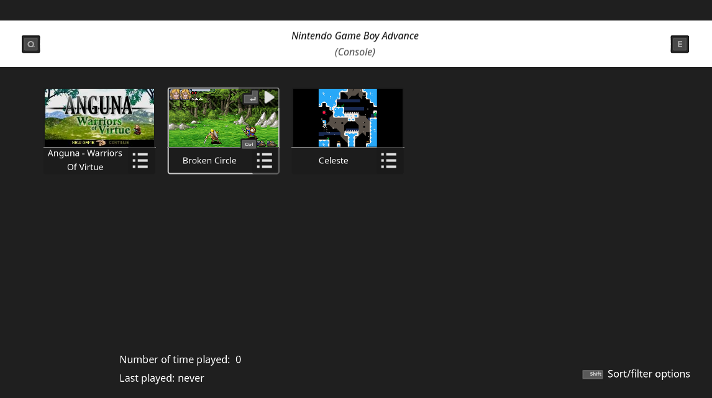
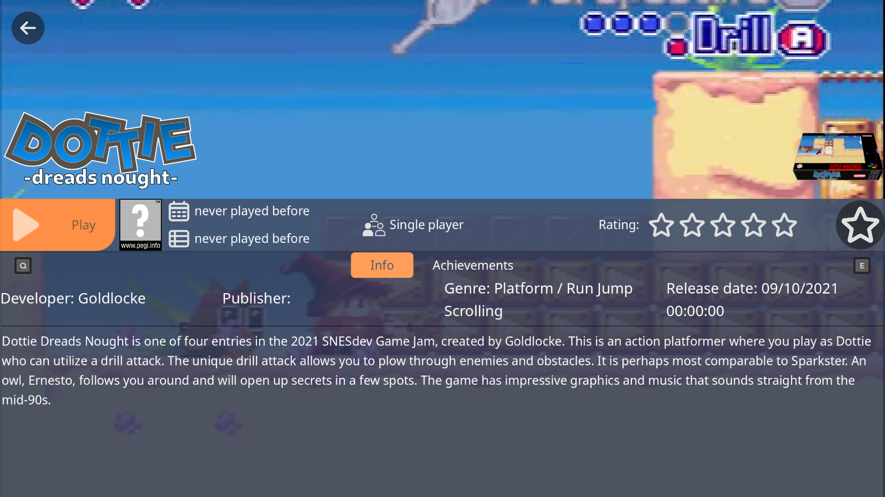
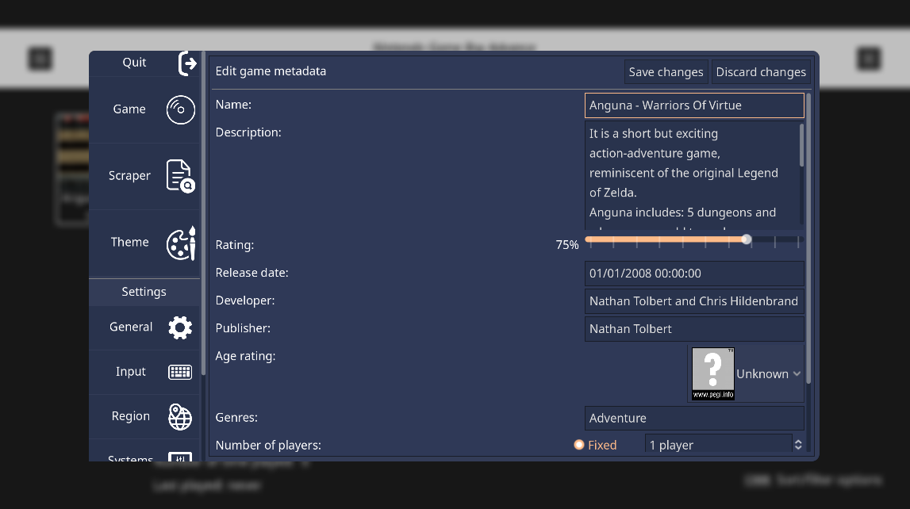
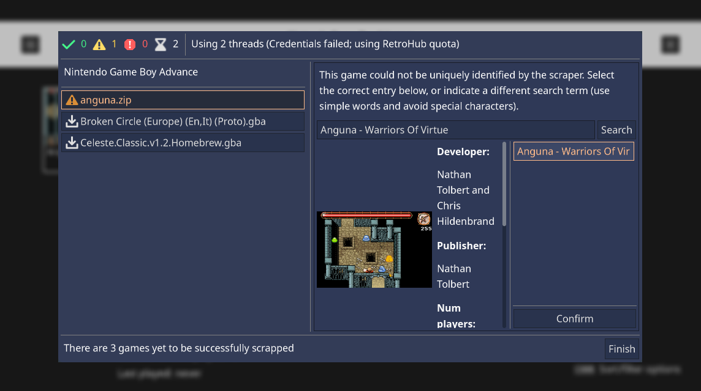
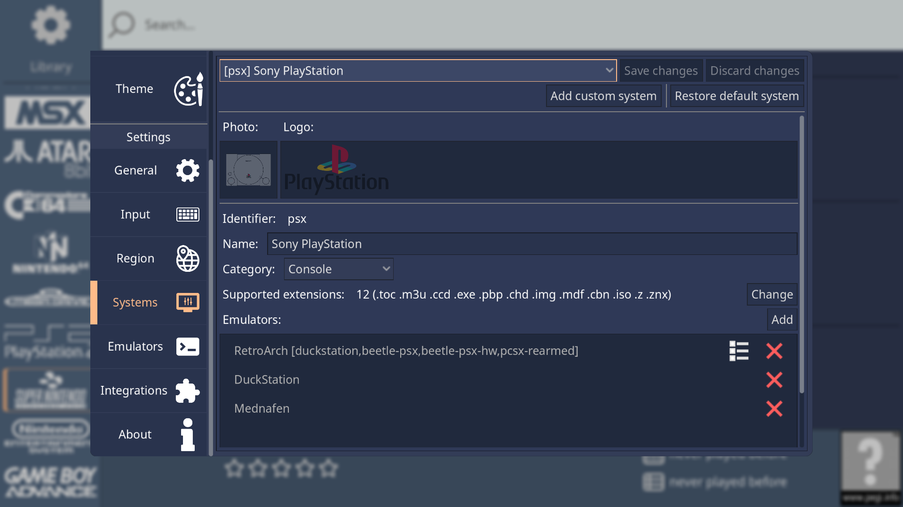
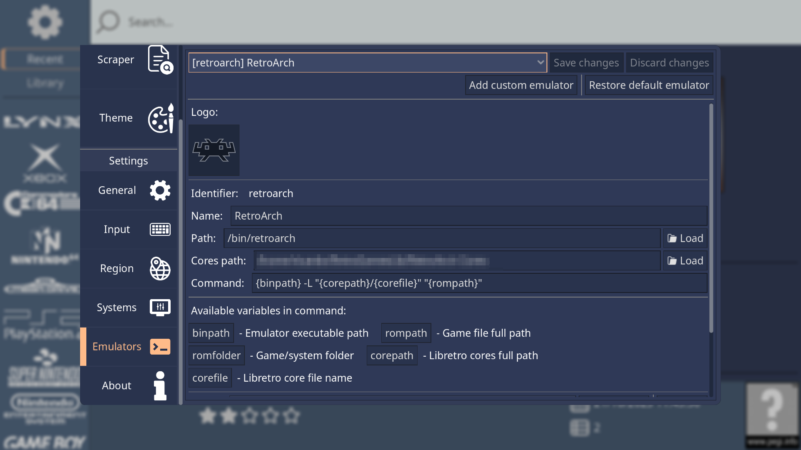

# RetroHub - Retro-gaming library frontend

RetroHub is a frontend application, allowing you to manage and launch your retro-gaming library. It is designed to be user-friendly and easy to use, yet packed with features and highly customizable.

RetroHub leverages the [Godot engine](https://godotengine.org/) to provide a powerful 2D and 3D game engine for theme developers. This way, themes can be very versatile and unique, creating a platform of endless possibilities for customizing your gaming setup.

> *Note*
> RetroHub is still in early development. Although it's ready for daily usage, do not move your library setup if you're already using another frontend.

## Screenshots

> The default theme, for selecting and launching games while previewing them.

> The default theme's game preview window, showing game information and media.

> Game metadata editor for editing information from the app.

> Automatic scraper for downloading game metadata and media.

> System configuration window for configuring emulators and other system settings.

> Emulator configuration window for configuring emulator settings.

## Downloads

RetroHub is available for Windows, macOS and Linux. It comes pre-configured with a large number of systems and emulators, requiring next to zero configuration to get started.

Pre-compiled binaries are available on the [Releases page](https://github.com/retrohub-org/retrohub/releases).

## Support

Check out the [docs](https://retrohub.readthedocs.io/en/latest/) for help setting up your library and using RetroHub.

If you find any bugs, have any suggestions, please [open an issue](https://github.com/retrohub-org/retrohub/issues) reporting it. You can also each out to us on [Discord](https://discord.gg/ZyunJshWG4) and/or [Reddit](https://www.reddit.com/r/RetroHub/).

## License

RetroHub's source code is released under the [MIT license](LICENSE). Pre-compiled binaries are released under the [GPLv3 license](LICENSE_BINARY).
